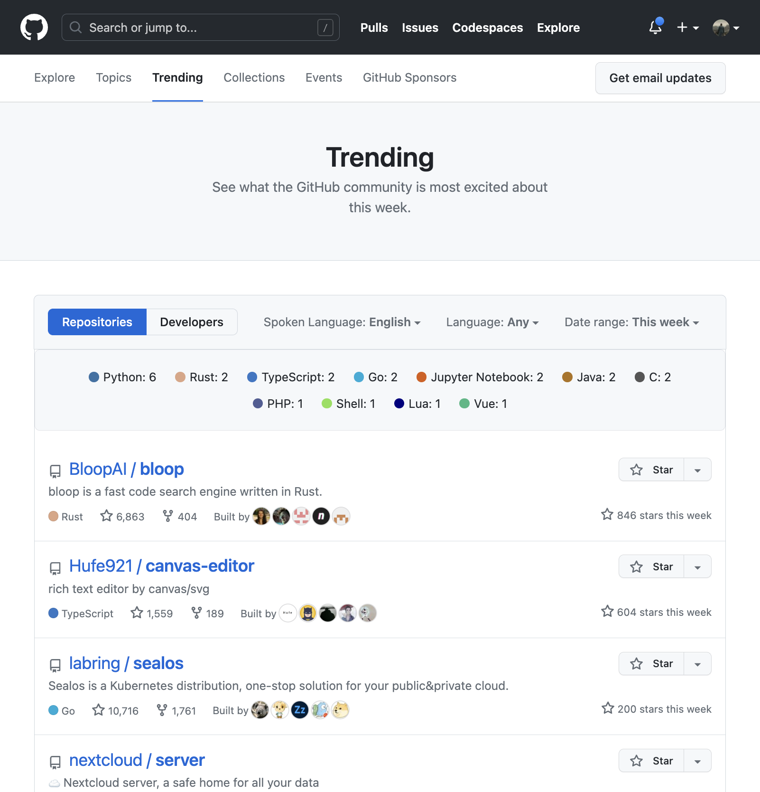

# GitHub Trending Languages - Chrome Extension




## Installation

1. Clone the repository: 
   ```sh
   git clone https://github.com/jmxo/github-trending-chrome-extension.git
   ```

2. Navigate to the repository folder:
   ```sh
   cd github-trending-chrome-extension
   ```

3. Install the dependencies:
   ```sh
   npm install
   ```

4. Build the project:
   ```sh
   npm run build
   ```

5. Open Google Chrome, navigate to `chrome://extensions`.

6. Turn on `Developer mode` (usually a switch in the top-right).

7. Click `Load unpacked`.

8. Select the cloned repository's root directory (which contains the `manifest.json` file)


The extension should now be loaded and ready to use when you visit the github trending page.